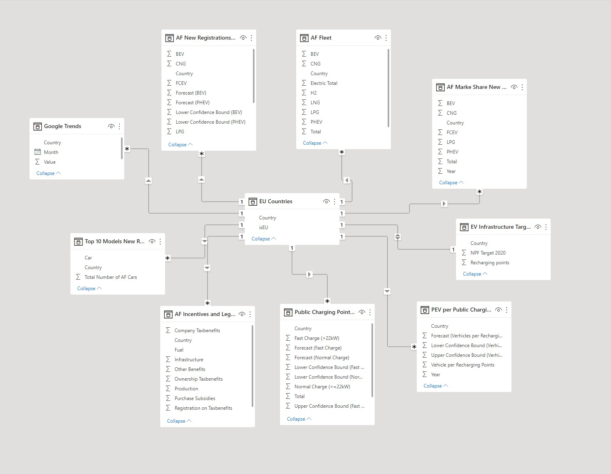
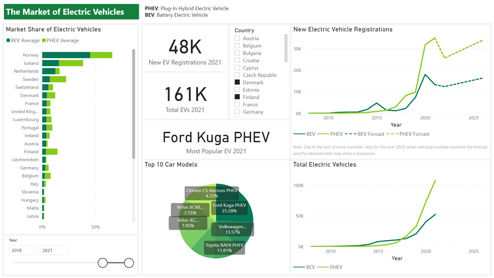
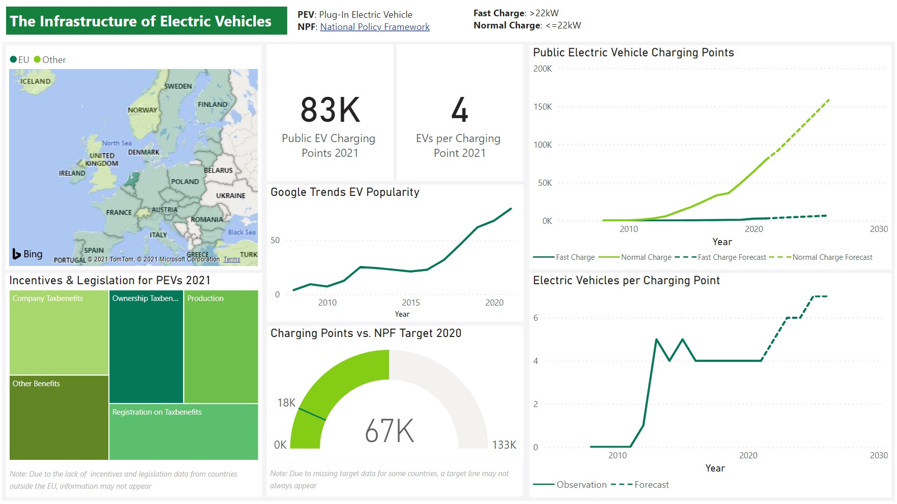

# Europe's Market of Electric Vehicles—A Case Study

This is an exploration of the European market for electric passenger vehicles through the use of a performance dashboard. The goal is to give private and public sector decision makers an overview of both the infrastructure and the market situation of EVs over time. The dashboard was built with _Microsoft Power BI_ and _Excel_ using a _star schema_ database modeling approach.

This project was a collaboration with [Thea A. Putnam](https://github.com/theaputnam) as part of group work in a Decision Support Systems course at [Tilburg University](https://www.tilburguniversity.edu) in the Netherlands.

## Data Preparation and Database Integration

    

    

    
</p

## References

We mainly used data from the [European Alternative Fuels Observatory](https://eafo.eu) as well as [Google Trends](https://trends.google.com).
